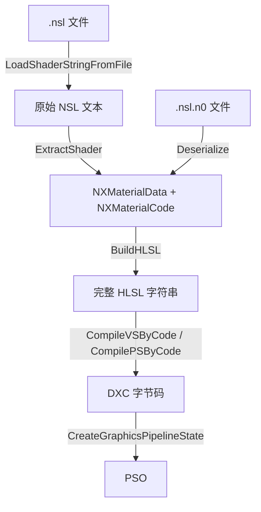

# NX 材质系统-NSL 与编译

## NSL 格式概述

NSL（Nix Shader Language）是 Nix 的自定义着色器描述格式，文件扩展名为 `.nsl`。它包裹 HLSL 代码，额外提供参数声明和结构化的 Pass 组织。运行时由 `NXCodeProcessHelper` 解析为 `NXMaterialData` + `NXMaterialCode`，再合成完整的 HLSL 代码交给 DXC 编译。

## NSL 文件结构

```
[NXShader]
{
    [Params]
    {
        [CBuffer]
        {
            float4 BaseColor : Color4;
            float Roughness : Slider(0.0, 1.0);
            float Metallic : Slider(0.0, 1.0);
        }
        Texture2D AlbedoMap;
        Texture2D NormalMap;
        SamplerState LinearSampler;
    }

    [GlobalFuncs]
    {
        float3 MyHelper(float3 input) { ... }
    }

    [SubShader]
    {
        [Pass]
        {
            [VS]
            {
                // 顶点着色器用户代码
            }
            [PS]
            {
                // 像素着色器用户代码
            }
        }
    }
}
```

### 各区块说明

| 区块 | 内容 | 解析目标 |
|------|------|---------|
| `[Params] > [CBuffer]` | 常量参数声明（类型 + 名称 + GUI 风格） | `NXMaterialData.cbArr` |
| `[Params] > Texture2D` | 纹理槽声明 | `NXMaterialData.txArr` |
| `[Params] > SamplerState` | 采样器声明 | `NXMaterialData.ssArr` |
| `[GlobalFuncs]` | 可复用的 HLSL 函数 | `NXMaterialCode.commonFuncs` |
| `[SubShader] > [Pass] > [VS]` | 顶点着色器入口代码 | `NXMaterialPassCode.vsFunc` |
| `[SubShader] > [Pass] > [PS]` | 像素着色器入口代码 | `NXMaterialPassCode.psFunc` |

### CBuffer 参数语法

```
类型 名称 : GUI风格(可选参数);
```

- **类型**：`float`、`float2`、`float3`、`float4`
- **GUI 风格**：`Value`、`Slider(min, max)`、`Color3`、`Color4` 等（对应 `NXGUICBufferStyle`）

## 序列化文件

每个 `.nsl` 文件配套一个 `.nsl.n0` 元数据文件（JSON 格式），保存运行时实例状态：

| 内容 | 说明 |
|------|------|
| `textures[]` | 纹理资源路径 |
| `samplers[]` | 采样器配置（filter、addressMode） |
| `cbuffer[]` | 常量值、GUI 风格、滑块参数 |
| `shadingModel` | 当前着色模型 |
| `sssProfilePath` | SSS 配置文件路径（`SubSurface` 模式）|

`.nsl` 存储代码结构，`.nsl.n0` 存储参数值。二者合在一起才是完整的材质实例。

## 解析-编译流程



### 各阶段关键函数

| 阶段 | 函数 | 说明 |
|------|------|------|
| 加载 | `LoadShaderStringFromFile()` | 读取 `.nsl` 文件为字符串 |
| 解析 | `NXCodeProcessHelper::ExtractShader()` | 递归解析各区块，填充 `NXMaterialData` 和 `NXMaterialCode` |
| 反序列化 | `NXCustomMaterial::Deserialize()` | 从 `.nsl.n0` 恢复参数值和纹理引用 |
| 生成 HLSL | `NXCodeProcessHelper::BuildHLSL()` | 将解析结果合成为可编译的 HLSL |
| 编译 | `NXShaderComplier::CompileVSByCode/CompilePSByCode` | 调用 DXC 编译 HLSL |
| 创建管线 | `ID3D12Device::CreateGraphicsPipelineState` | 创建 D3D12 PSO |

### HLSL 生成细节

`BuildHLSL()` 按以下顺序拼接 HLSL：

1. **`BuildHLSL_Include()`** — `#include` 引擎公共头文件（`Common.fx`、`Math.fx` 等）
2. **`BuildHLSL_Params()`** — 生成 `cbuffer`、`Texture2D`、`SamplerState` 声明
3. **`BuildHLSL_GlobalFuncs()`** — 拼接用户自定义函数
4. **`BuildHLSL_PassFuncs()`** — 拼接 Pass 函数体
5. **`BuildHLSL_Entry()`** — 生成引擎标准的 VS/PS 入口函数，内部调用用户代码

生成的 VS/PS 入口遵循引擎的 G-Buffer 输出约定（RT0~RT3），用户代码只需填写材质逻辑，无需关心 G-Buffer 布局。

## Root Signature 布局

### NXCustomMaterial

编译时动态生成的 Root Signature 结构：

| Root 参数 | 绑定 | 说明 |
|----------|------|------|
| `[0]` CBV | `b0, space0` | 引擎全局数据（View/Projection 矩阵等） |
| `[1]` CBV | `b1, space0` | 引擎全局数据（时间、帧号等） |
| `[2]` CBV | `b0, space1` | 材质 CBuffer（所有 `NXMatDataCBuffer` 打包） |
| `[3]` DescriptorTable | `t0..tN, space0` | 材质纹理 |
| `[4]` DescriptorTable | `space1`（可选） | 地形资源 |
| `[5]` DescriptorTable | `space0/2`（可选） | 虚拟纹理 UAV/SRV |

**静态采样器**：每个 `NXMatDataSampler` 生成一个静态采样器 `s0..sM`。

### NXEasyMaterial

简化布局：2 个引擎 CBV + 1 个纹理 SRV + 1 个静态采样器。

### 材质 CBuffer 内存布局

`NXCustomMaterial::UpdateCBData()` 将所有 CBuffer 参数打包到一个连续的 `float` 数组中：

```
| param0 (vec4 对齐) | param1 (vec4 对齐) | ... | shadingModel | sssIndex |
```

- 每个参数按 16 字节（`Vector4`）对齐
- 末尾追加着色模型 ID 和 SSS profile 索引
- 通过 `NXConstantBuffer<std::vector<float>>` 上传到 GPU

## 地形材质的特殊处理

当材质标记 `m_bEnableTerrainGPUInstancing = true` 时，`BuildHLSL()` 会额外生成：
- 地形相关的 SRV 绑定（NodeID 纹理、描述数组等，绑定到 `space1`）
- 虚拟纹理相关的 UAV/SRV 绑定（绑定到 `space2`）
- 修改 VS 入口以支持 GPU 实例化和地形补丁寻址

详见 [[NX 地形系统/目录]] 和 [[Adaptive Virtual Texture]]。
