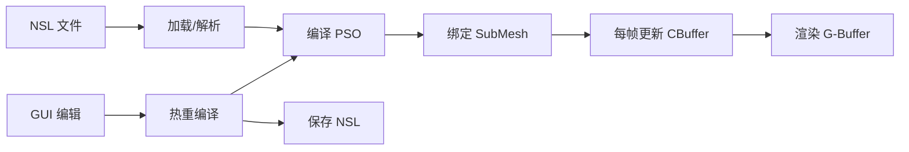
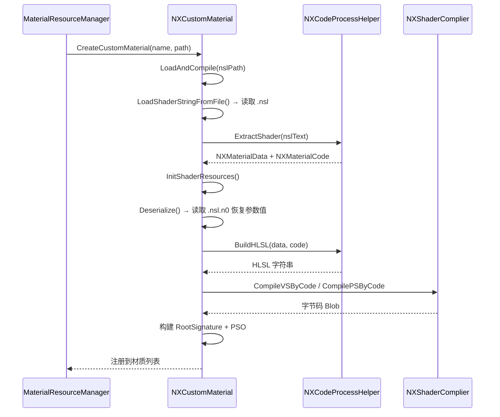
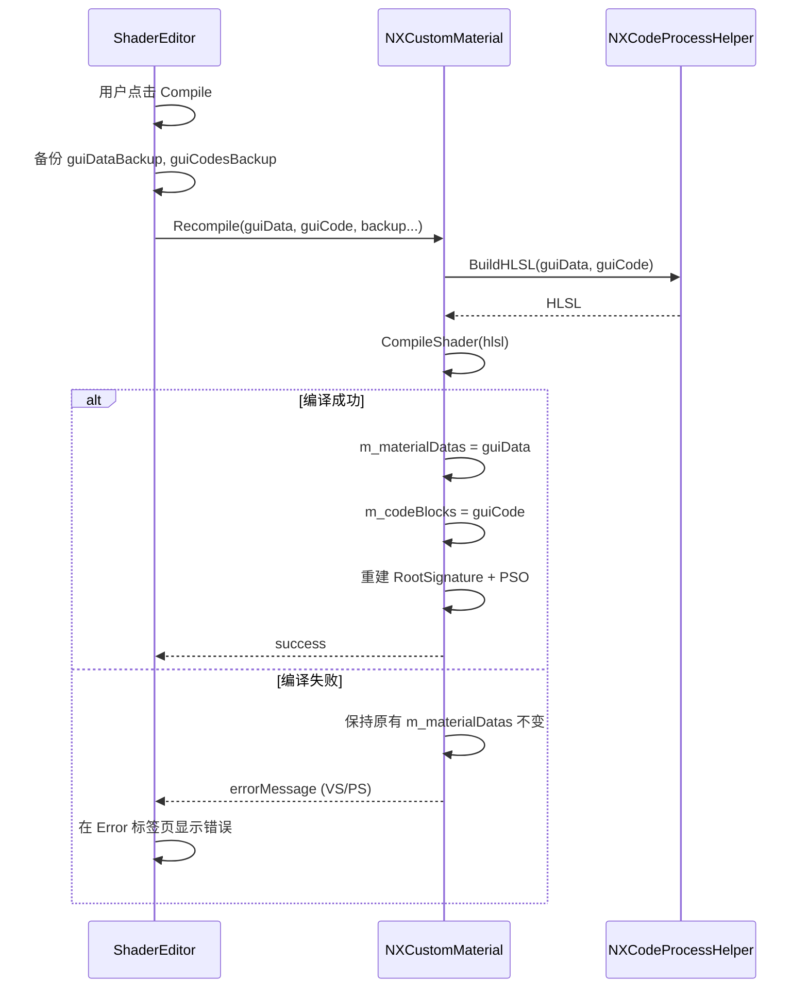

# NX 材质系统-数据流

## 材质生命周期总览



## 1. 材质加载

入口：`NXMaterialResourceManager::LoadFromNSLFile(path)`



**异步加载支持**：`NXSubMeshBase` 通过 `m_nMatReloadingState` 三态机实现异步材质替换：
- `None`：无加载操作
- `Loading`：正在加载，显示 `NXEasyMaterial`（loading 纹理）
- `Replacing`：加载完成，等待下一帧替换为 `NXCustomMaterial`

## 2. 材质绑定

材质通过 `NXMeshResourceManager::BindMaterial()` 与 SubMesh 建立双向引用：

```
NXSubMeshBase.m_pMaterial ←→ NXMaterial.m_pRefSubMeshes[]
```

一个材质可被多个 SubMesh 共享。`NXMaterial` 维护引用列表，便于材质热替换时批量通知。

## 3. 每帧更新

`NXCustomMaterial::Update()` 在每帧调用：

1. 检查 `m_bIsDirty` 标志
2. 若脏：调用 `UpdateCBData()`
   - 将所有 `NXMatDataCBuffer` 的值按 vec4 对齐打包
   - 追加 `shadingModel` 和 `sssProfileGBufferIndex`
   - 写入 `m_cbData`（`NXConstantBuffer`）
3. 清除脏标志

## 4. G-Buffer 渲染

`NXCustomMaterial::Render(cmdList)` 在 G-Buffer Pass 中被调用：

```
1. SetGraphicsRootSignature(m_pRootSig)
2. SetPipelineState(m_pPSO)
3. 遍历纹理 → PushFluid(SRV) 到描述符堆
4. SetGraphicsRootDescriptorTable(3, textureHandle)
5. SetGraphicsRootConstantBufferView(2, cbufferGPUAddr)
```

G-Buffer 输出 4 个 RT：

| RT | 内容 |
|----|------|
| RT0 | 深度信息 |
| RT1 | 材质数据（金属度、粗糙度等） |
| RT2 | 法线 |
| RT3 | 颜色（Albedo） |

## 5. GUI 编辑与热重编译

### 材质属性面板（NXGUIMaterial）

`NXGUIMaterial::RenderMaterialUI_Custom()` 渲染参数编辑界面：
- CBuffer 参数根据 `NXGUICBufferStyle` 渲染为滑块/颜色拾取器/数值框
- 纹理参数显示缩略图和文件路径
- 修改参数时通过 `pFastLink` 机制实时同步到材质

### 着色器编辑器（NXGUIMaterialShaderEditor）

编辑器提供多标签页界面：

| 标签页 | 功能 |
|--------|------|
| Code | HLSL 代码编辑（VS/PS/公共函数），内嵌 `NXGUICodeEditor` 提供语法高亮 |
| Feature | 着色模型选择器（StandardLit / Unlit / SubSurface） |
| Params | 参数管理（增删改查、排序、GUI 风格设置） |
| Compiles | 编译状态和错误信息 |
| Settings | 材质设置 |

### 热重编译流程



**备份机制**：编辑器始终维护 `m_guiDataBackup` 和 `m_guiCodesBackup`。编译失败时恢复到备份状态，确保材质始终可用。

### 保存

`OnBtnSaveClicked()` → `NXCustomMaterial::SaveToNSLFile()`：
1. `NXCodeProcessHelper::SaveToNSLFile()` — 将 `NXMaterialData` + `NXMaterialCode` 写回 `.nsl` 文件
2. `NXCustomMaterial::Serialize()` — 将参数值写入 `.nsl.n0` 文件

## 描述符堆管理

材质纹理通过 `NXShaderVisibleDescriptorHeap` 绑定到 GPU：

1. 每帧 `Render()` 时，将所有纹理的 SRV 通过 `PushFluid()` 推入堆
2. `Submit()` 完成后返回堆上的起始 handle
3. 通过 `SetGraphicsRootDescriptorTable` 绑定到 Root Parameter

这是帧级别的动态分配，不需要预分配固定描述符槽位。
