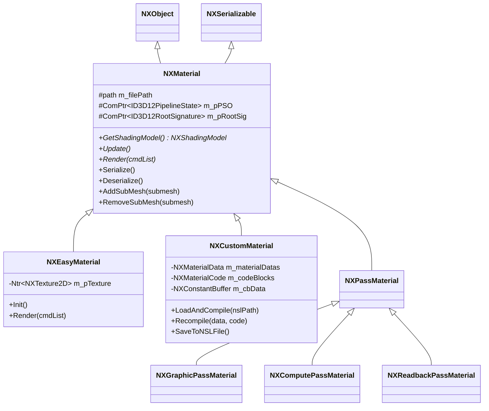
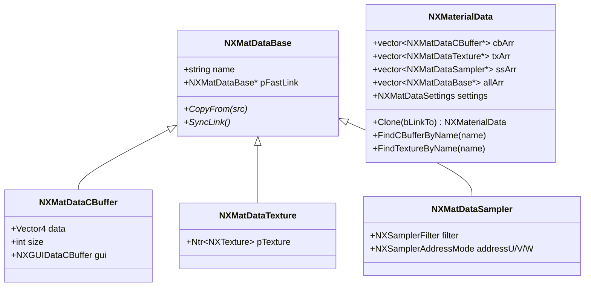

# NX 材质系统-架构

## 类层次结构

材质系统的两条继承链共享同一个基类 `NXMaterial`。



### 内容材质

| 类 | 用途 | 说明 |
|----|------|------|
| `NXMaterial` | 抽象基类 | 持有 PSO、Root Signature、文件路径；跟踪引用该材质的 SubMesh 列表 |
| `NXEasyMaterial` | 过渡占位材质 | 在材质异步加载期间显示 loading 纹理，加载失败时显示 error 纹理。始终为 `Unlit` 着色模型 |
| `NXCustomMaterial` | 可编程 PBR 材质 | 从 `.nsl` 文件加载，支持运行时编辑和热重编译。是实际承载物体外观的主要材质类型 |

### Pass 材质

Pass 材质用于渲染图（Render Graph）中的各类渲染 Pass，不定义物体外观，而是描述一个 Pass 的管线状态和资源绑定。详见 [[NXRG/代码文档/文档汇总]]。

| 类 | 用途 |
|----|------|
| `NXGraphicPassMaterial` | 图形 Pass（阴影贴图、延迟光照、后处理等） |
| `NXComputePassMaterial` | 计算 Pass（地形 LOD、纹理处理等） |
| `NXReadbackPassMaterial` | GPU→CPU 回读 Pass（虚拟纹理反馈等） |

## 着色模型（Shading Model）

```cpp
enum class NXShadingModel {
    StandardLit = 0,  // 标准 PBR（漫反射 + 高光）
    Unlit       = 1,  // 无光照
    SubSurface  = 2,  // 次表面散射（Burley SSS）
};
```

着色模型决定了 G-Buffer 的写入方式和延迟光照阶段的处理逻辑：
- `StandardLit`：标准的金属度/粗糙度工作流
- `Unlit`：直接输出颜色，跳过光照计算
- `SubSurface`：在 G-Buffer 中通过 Stencil 标记 SSS 像素，延迟阶段用 Burley SSS 模型额外计算次表面散射，并关联 `NXSSSDiffuseProfile`

## 核心数据类型

### 材质参数（NXMaterialData）

`NXMaterialData` 是材质的参数集合，存储所有 CBuffer 常量、纹理引用和采样器配置。



**关键设计——`pFastLink` 机制：**
GUI 编辑器在编辑时使用 `Clone(bLinkTo=true)` 创建参数副本。副本的 `pFastLink` 指向原始数据，调用 `SyncLink()` 即可将 GUI 修改同步回材质，避免了频繁的全量拷贝。

### 材质代码（NXMaterialCode）

```cpp
struct NXMaterialCode {
    std::string shaderName;                   // 着色器名
    NXMaterialFunctionsCode commonFuncs;      // 公共函数集合
    std::vector<NXMaterialPassCode> passes;   // Pass 代码（当前仅一个）
};

struct NXMaterialPassCode {
    std::string name;              // Pass 名称
    NXMaterialCodeBlock vsFunc;    // 顶点着色器代码
    NXMaterialCodeBlock psFunc;    // 像素着色器代码
};
```

### GUI 控件风格

CBuffer 参数在 Inspector 面板中的显示方式由 `NXGUICBufferStyle` 控制：

| 风格 | 说明 |
|------|------|
| `Value` ~ `Value4` | 1-4 分量数值输入框 |
| `Slider` ~ `Slider4` | 1-4 分量滑块（支持 min/max 范围） |
| `Color3` / `Color4` | 颜色拾取器（RGB / RGBA） |

## 材质资源管理器

`NXMaterialResourceManager`（单例，通过 `NXResourceManager` 访问）负责材质的生命周期管理：

| 功能 | 方法 |
|------|------|
| 加载 | `LoadFromNSLFile(path)` — 从 `.nsl` 文件创建 `NXCustomMaterial` |
| 查找 | `FindMaterial(path)` — 按路径查找已加载材质 |
| 替换 | `ReplaceMaterial(old, new)` — 热替换材质（编辑器场景） |
| 占位 | `GetLoadingMaterial()` / `GetErrorMaterial()` — 获取加载中/错误占位材质 |
| SSS | `GetOrAddSSSProfile(path)` — 获取或创建次表面散射配置文件 |
| 帧更新 | `OnReload()` — 每帧检查并处理材质热重载请求 |
