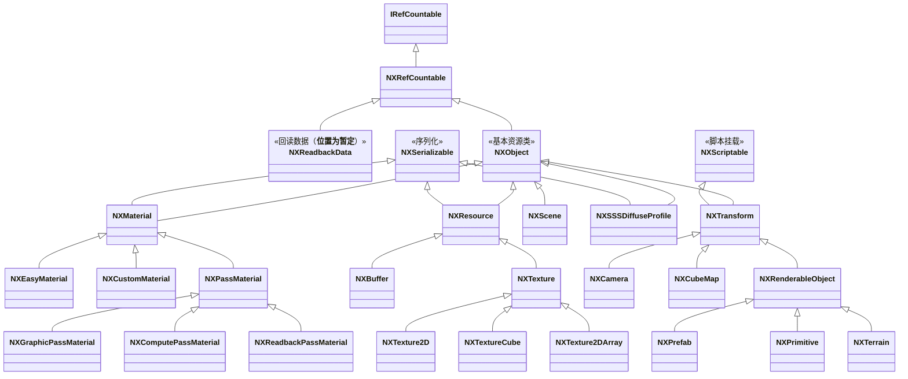

```mermaid
classDiagram 
	class NXReadbackData{
		<<回读数据（**位置为暂定**）>>
	}
    class NXObject {
	    <<基本资源类>>
    }
    class NXSerializable{
	    <<序列化>>
    }
    class NXScriptable{
	    <<脚本挂载>>
    }

    IRefCountable <|-- NXRefCountable
    NXRefCountable <|-- NXObject
    NXRefCountable <|-- NXReadbackData
    NXObject <|-- NXMaterial
    NXObject <|-- NXResource
    NXObject <|-- NXScene
    NXObject <|-- NXSSSDiffuseProfile
    NXObject <|-- NXTransform
    
    NXSerializable <|-- NXMaterial
    NXSerializable <|-- NXResource
    NXSerializable <|-- NXSSSDiffuseProfile

    NXScriptable <|-- NXTransform

    NXMaterial <|-- NXEasyMaterial
    NXMaterial <|-- NXCustomMaterial
    NXMaterial <|-- NXPassMaterial
    NXPassMaterial <|-- NXGraphicPassMaterial
    NXPassMaterial <|-- NXComputePassMaterial
    NXPassMaterial <|-- NXReadbackPassMaterial

    NXResource <|-- NXBuffer
    NXResource <|-- NXTexture
    NXTexture <|-- NXTexture2D
    NXTexture <|-- NXTextureCube
    NXTexture <|-- NXTexture2DArray

    NXTransform <|-- NXCamera
    NXTransform <|-- NXCubeMap
    NXTransform <|-- NXRenderableObject
    NXRenderableObject <|-- NXPrefab
    NXRenderableObject <|-- NXPrimitive
    NXRenderableObject <|-- NXTerrain

```
	