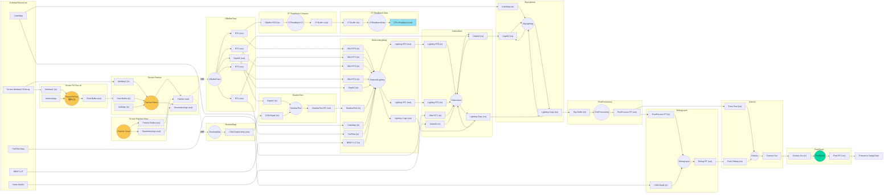

```mermaid
flowchart LR
  %%{init: {"flowchart": {"nodeSpacing": 15, "rankSpacing": 30}} }%%
  
  %% ========== 外部资源 ==========
  subgraph EXTERNAL[External Resources]
    R_CubeMap["CubeMap"]
    R_PreFilter["PreFilter Map"]
    R_BRDF["BRDF LUT"]
    R_Noise64["Noise 64x64"]
    R_MinMaxZ["Terrain MinMaxZ 2DArray"]
  end

  %% ========== 地形填充测试（循环6次） ==========
  subgraph S_TerrainFill[Terrain Fill Test x6]
    P_Fill(("TerrainFillTest<br/>循环6次"))
    Fill_MinMaxZ_in["MinMaxZ (in)"]
    Fill_IndiArgs["IndirectArgs"]
    Fill_BufferOut["Final Buffer (out)"]
    Fill_MinMaxZ_in --> P_Fill
    Fill_IndiArgs --> P_Fill
    P_Fill --> Fill_BufferOut
  end
  R_MinMaxZ --> Fill_MinMaxZ_in

  %% ========== GPU Terrain Patcher Clear ==========
  subgraph S_PatchClear[Terrain Patcher Clear]
    P_Clear(("Patcher Clear"))
    Clear_Patcher_out["Patcher Buffer (out)"]
    Clear_DrawArgs_out["DrawIndexArgs (out)"]
    P_Clear --> Clear_Patcher_out
    P_Clear --> Clear_DrawArgs_out
  end

  %% ========== GPU Terrain Patcher ==========
  subgraph S_Patcher[Terrain Patcher]
    P_Patch(("Patcher Patch"))
    Patch_MinMaxZ_in["MinMaxZ (in)"]
    Patch_Final_in["Final Buffer (in)"]
    Patch_IndiArgs_in["IndiArgs (in)"]
    Patch_Patcher_out["Patcher (out)"]
    Patch_DrawArgs_out["DrawIndexArgs (out)"]
    Patch_MinMaxZ_in --> P_Patch
    Patch_Final_in --> P_Patch
    Patch_IndiArgs_in --> P_Patch
    P_Patch --> Patch_Patcher_out
    P_Patch --> Patch_DrawArgs_out
  end
  Fill_BufferOut --> Patch_Final_in
  R_MinMaxZ --> Patch_MinMaxZ_in
  Clear_Patcher_out --> Patch_Patcher_out
  Clear_DrawArgs_out --> Patch_DrawArgs_out

  %% ========== GBuffer ==========
  subgraph S_GBuffer[GBufferPass]
    P_GBuffer(("GBufferPass"))
    G_RT0_out["RT0 (out)"]
    G_RT1_out["RT1 (out)"]
    G_RT2_out["RT2 (out)"]
    G_RT3_out["RT3 (out)"]
    G_Depth_out["DepthZ (out)"]
    P_GBuffer --> G_RT0_out
    P_GBuffer --> G_RT1_out
    P_GBuffer --> G_RT2_out
    P_GBuffer --> G_RT3_out
    P_GBuffer --> G_Depth_out
  end
  Patch_Patcher_out -.依赖.-> P_GBuffer

  %% ========== VT Readback（计算） ==========
  subgraph S_VTReadback[VT Readback Compute]
    P_VTReadback(("VTReadback CS"))
    VT_RT0_in["GBuffer RT0 (in)"]
    VT_Buffer_out["VT Buffer (out)"]
    VT_RT0_in --> P_VTReadback
    P_VTReadback --> VT_Buffer_out
  end
  G_RT0_out --> VT_RT0_in

  %% ========== VT Readback Data（输出到CPU） ==========
  subgraph S_VTData[VT Readback Data]
    P_VTData(("VTReadbackData"))
    VTData_Buffer_in["VT Buffer (in)"]
    VTData_CPU_out["CPU Readback (out)"]
    VTData_Buffer_in --> P_VTData
    P_VTData --> VTData_CPU_out
  end
  VT_Buffer_out --> VTData_Buffer_in

  %% ========== ShadowMap ==========
  subgraph S_ShadowMap[ShadowMap]
    P_ShadowMap(("ShadowMap"))
    SM_CSMDepth_out["CSM Depth Array (out)"]
    P_ShadowMap --> SM_CSMDepth_out
  end
  Patch_Patcher_out -.依赖.-> P_ShadowMap

  %% ========== ShadowTest ==========
  subgraph S_ShadowTest[ShadowTest]
    P_ShadowTest(("ShadowTest"))
    ST_Depth_in["DepthZ (in)"]
    ST_CSM_in["CSM Depth (in)"]
    ST_RT_out["ShadowTest RT (out)"]
    ST_Depth_in --> P_ShadowTest
    ST_CSM_in --> P_ShadowTest
    P_ShadowTest --> ST_RT_out
  end
  G_Depth_out --> ST_Depth_in
  SM_CSMDepth_out --> ST_CSM_in

  %% ========== Deferred Lighting ==========
  subgraph S_Deferred[DeferredLighting]
    P_Deferred(("DeferredLighting"))
    D_RT0_in["GBuf RT0 (in)"]
    D_RT1_in["GBuf RT1 (in)"]
    D_RT2_in["GBuf RT2 (in)"]
    D_RT3_in["GBuf RT3 (in)"]
    D_Depth_in["DepthZ (in)"]
    D_Shadow_in["ShadowTest (in)"]
    D_Cube_in["CubeMap (in)"]
    D_Pre_in["PreFilter (in)"]
    D_BRDF_in["BRDF LUT (in)"]
    D_Lit_out["Lighting RT0 (out)"]
    D_LitSpec_out["Lighting RT1 (out)"]
    D_LitCopy_out["Lighting Copy (out)"]
    D_RT0_in --> P_Deferred
    D_RT1_in --> P_Deferred
    D_RT2_in --> P_Deferred
    D_RT3_in --> P_Deferred
    D_Depth_in --> P_Deferred
    D_Shadow_in --> P_Deferred
    D_Cube_in --> P_Deferred
    D_Pre_in --> P_Deferred
    D_BRDF_in --> P_Deferred
    P_Deferred --> D_Lit_out
    P_Deferred --> D_LitSpec_out
    P_Deferred --> D_LitCopy_out
  end
  G_RT0_out --> D_RT0_in
  G_RT1_out --> D_RT1_in
  G_RT2_out --> D_RT2_in
  G_RT3_out --> D_RT3_in
  G_Depth_out --> D_Depth_in
  ST_RT_out --> D_Shadow_in
  R_CubeMap --> D_Cube_in
  R_PreFilter --> D_Pre_in
  R_BRDF --> D_BRDF_in

  %% ========== Subsurface ==========
  subgraph S_SSS[Subsurface]
    P_SSS(("Subsurface"))
    S_Lit_in["Lighting RT0 (in)"]
    S_LitSpec_in["Lighting RT1 (in)"]
    S_GB1_in["GBuf RT1 (in)"]
    S_Noise_in["Noise64 (in)"]
    S_Depth_rw["DepthZ (rw)"]
    S_Buf_rw["Lighting Copy (rw)"]
    S_Lit_in --> P_SSS
    S_LitSpec_in --> P_SSS
    S_GB1_in --> P_SSS
    S_Noise_in --> P_SSS
    S_Depth_rw --> P_SSS
    S_Buf_rw --> P_SSS
    P_SSS --> S_Depth_rw
    P_SSS --> S_Buf_rw
  end
  D_Lit_out --> S_Lit_in
  D_LitSpec_out --> S_LitSpec_in
  G_RT1_out --> S_GB1_in
  R_Noise64 --> S_Noise_in
  G_Depth_out --> S_Depth_rw
  D_LitCopy_out --> S_Buf_rw

  %% ========== SkyLighting ==========
  subgraph S_Sky[SkyLighting]
    P_Sky(("SkyLighting"))
    Sky_Cube_in["CubeMap (in)"]
    Sky_Buf_rw["Lighting Copy (rw)"]
    Sky_Depth_rw["DepthZ (rw)"]
    Sky_Cube_in --> P_Sky
    Sky_Buf_rw --> P_Sky
    Sky_Depth_rw --> P_Sky
    P_Sky --> Sky_Buf_rw
    P_Sky --> Sky_Depth_rw
  end
  R_CubeMap --> Sky_Cube_in
  S_Buf_rw --> Sky_Buf_rw
  S_Depth_rw --> Sky_Depth_rw

  %% ========== PostProcessing ==========
  subgraph S_Post[PostProcessing]
    P_Post(("PostProcessing"))
    Post_In["Sky Buffer (in)"]
    Post_Out["PostProcess RT (out)"]
    Post_In --> P_Post
    P_Post --> Post_Out
  end
  Sky_Buf_rw --> Post_In

  %% ========== DebugLayer ==========
  subgraph S_Debug[DebugLayer]
    P_Debug(("DebugLayer"))
    Debug_Post_in["PostProcess RT (in)"]
    Debug_CSM_in["CSM Depth (in)"]
    Debug_Out["Debug RT (out)"]
    Debug_Post_in --> P_Debug
    Debug_CSM_in --> P_Debug
    P_Debug --> Debug_Out
  end
  Post_Out --> Debug_Post_in
  SM_CSMDepth_out --> Debug_CSM_in

  %% ========== Gizmos（条件输出） ==========
  subgraph S_Gizmos[Gizmos]
    P_Gizmos(("Gizmos"))
    Giz_In_Post["From Post (rw)"]
    Giz_In_Debug["From Debug (rw)"]
    Giz_Out["Gizmos Out"]
    Giz_In_Post --> P_Gizmos
    Giz_In_Debug --> P_Gizmos
    P_Gizmos --> Giz_Out
  end
  Post_Out --> Giz_In_Post
  Debug_Out --> Giz_In_Debug

  %% ========== FinalQuad（新增） ==========
  subgraph S_Final[FinalQuad]
    P_Final(("FinalQuad"))
    Final_Gizmos_in["Gizmos Out (in)"]
    Final_RT_out["Final RT (out)"]
    Final_Gizmos_in --> P_Final
    P_Final --> Final_RT_out
  end
  Giz_Out --> Final_Gizmos_in

  %% ========== 呈现 ==========
  Present["Present to SwapChain"]
  Final_RT_out --> Present

  style P_Fill fill:#f9c74f
  style P_Clear fill:#f9c74f
  style P_Patch fill:#f9c74f
  style VTData_CPU_out fill:#90e0ef
  style P_Final fill:#06d6a0
```
